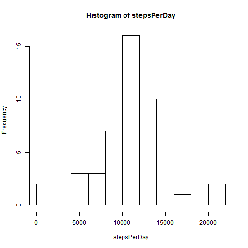
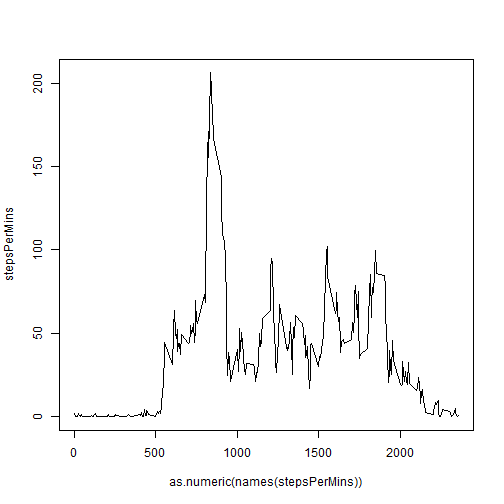
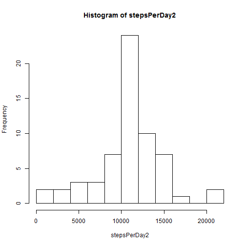
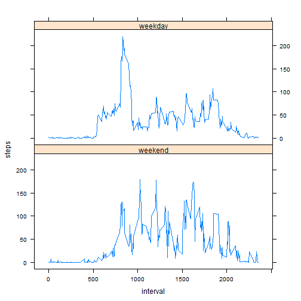

## Loading and preprocessing the data
Assuming the data is in working directory, the data file is loaded and variables "date" is changed to Date format.

```r
data<-read.csv("activity.csv")
data$date<-as.Date(data$date)
```


## What is mean total number of steps taken per day?

The first step is to calculate the total number of steps taken per day:


```r
stepsPerDay<-tapply(data$steps,data$date,sum)
```

A Histogram of the total number of steps taken per day is maked:


```r
hist(stepsPerDay,breaks=10)
```

 

Finally, to answer the question, the mean and median are calculated:


```r
mean(stepsPerDay,na.rm=TRUE)
```

```
## [1] 10766.19
```

```r
median(stepsPerDay,na.rm = TRUE)
```

```
## [1] 10765
```

## What is the average daily activity pattern?

This question can be answered by calculating the average number of steps per interval and them making a time series plot of 5 mins interval:

```r
stepsPerMins<-tapply(data$steps,data$interval,mean,na.rm=TRUE)
plot(as.numeric(names(stepsPerMins)),stepsPerMins,type="l")
```

 
The 5-minute interval, on average across all the days in the dataset that  contains the maximum number of steps is the 835, calculated by the following code:

```r
names(which.max(stepsPerMins))
```

```
## [1] "835"
```

## Imputing missing values

The total number of missing values in the data set is given by the summary function:

```r
summary(data)
```

```
##      steps             date               interval     
##  Min.   :  0.00   Min.   :2012-10-01   Min.   :   0.0  
##  1st Qu.:  0.00   1st Qu.:2012-10-16   1st Qu.: 588.8  
##  Median :  0.00   Median :2012-10-31   Median :1177.5  
##  Mean   : 37.38   Mean   :2012-10-31   Mean   :1177.5  
##  3rd Qu.: 12.00   3rd Qu.:2012-11-15   3rd Qu.:1766.2  
##  Max.   :806.00   Max.   :2012-11-30   Max.   :2355.0  
##  NA's   :2304
```
As we can see, the column "steps" is the only variable that has NA's values, with a total of 2304.

The strategy used for imputate the NA values is to use the average number of steps per interval. 

To implement this strategy, a function called "lookvalue" is created. The function takes the "interval"" corresponding to the "steps" observation with NA value and return the average steps per 5-minutes interval. Later, a new dataset is created and the NA's values are replace by the average steps per 5-minutes interval.


```r
lookValue<-function(x,y) y[as.character(x)] 
data2=data
data2$steps<-replace(data2$steps,is.na(data2$steps),lookValue(data2$interval[is.na(data2$steps)],stepsPerMins))
```

The difference between data with NA's and without NA's can seen by calculaten the mean/median of total steps per day and making a histogram

```r
#Calculate mean and median for the completed data set
stepsPerDay2<-tapply(data2$steps,data2$date,sum)
hist(stepsPerDay2,breaks=10)
```

 

```r
mean(stepsPerDay2)
```

```
## [1] 10766.19
```

```r
median(stepsPerDay2)
```

```
## [1] 10766.19
```

```r
#calculating the mean of  steps per interval
stepsPerMins2<-tapply(data2$steps,data2$interval,mean)
```
With NA's replaced, mean and median are the same.The histogram shows a great increase in the frequency of days with 10000 to 11000 steps.

## Are there differences in activity patterns between weekdays and weekends?

To answer this question, a factor variable with two leves has been created.


```r
data2$weekday<-!(weekdays(data2$date)=="domingo"|weekdays(data2$date)=="sabado")
data2$weekday<-as.factor(data2$weekday)
levels(data2$weekday)<-c("weekend","weekday")
```

Later, a set arranged by 5-minutes interval and weekday/weekend is created. A plot shows the average number of steps taken, averaged across all weekday days or weekend days.

```r
stepsWeekday<-aggregate(data2$steps,by=list(data2$interval,data2$weekday),FUN=mean)
names(stepsWeekday)=c("interval","weekday","steps")
library(lattice)
xyplot(steps~interval|weekday,data=stepsWeekday,layout=c(1,2),type="l")
```

 

As can be seen in the plot, there is an important peak about the interval "800" on weekdays. This agree with the interval that contains the maximum number of steps, which is 835. In can be said that the exercise routine is often on weekdays.
